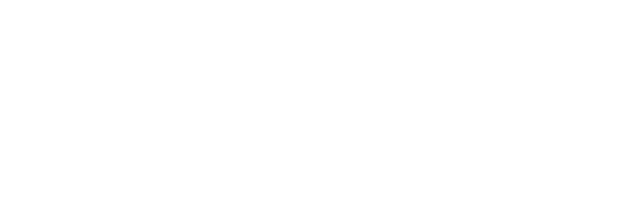
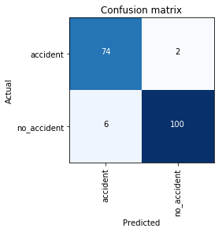
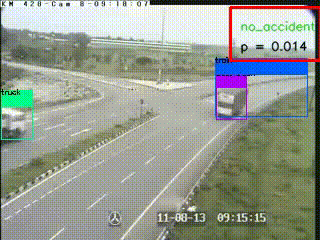

# algo-ia

Deep Learning part of the Datathon Energie et Mobilité organized by CRE and ARAFER
Used YOLO for object detection and Darknet as a feature extractor
Trained and finetuned a model based on resnet34 weights for accident recognition achieving cutting-edge results on test set

**Full demo**

**Dataset and models**

The dataset and its sources (url mainly) and all the trained models during the competition can be found on this [link](https://drive.google.com/file/d/1_D-5OdCVTxRxY1lHZ1ooNzKMZQyo-tAZ/view?usp=sharing)
